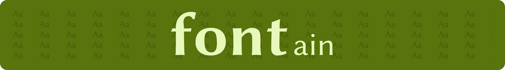
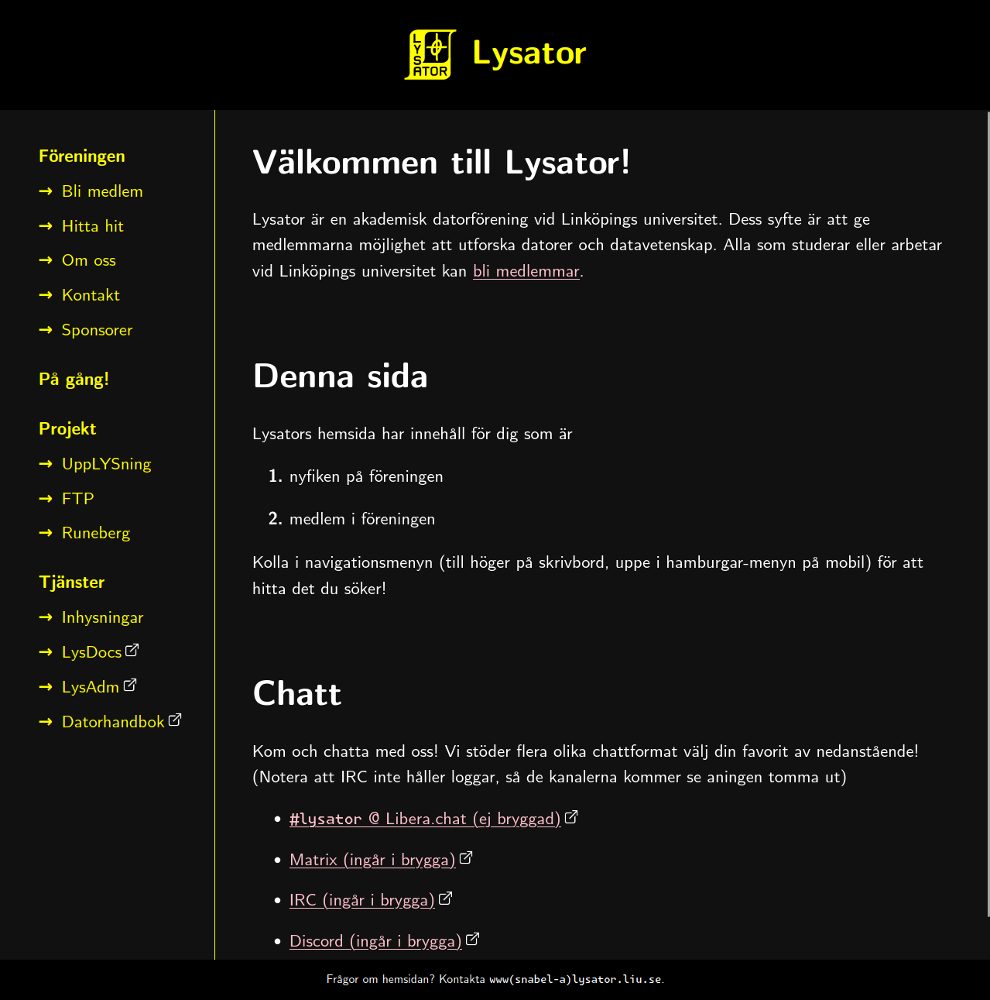
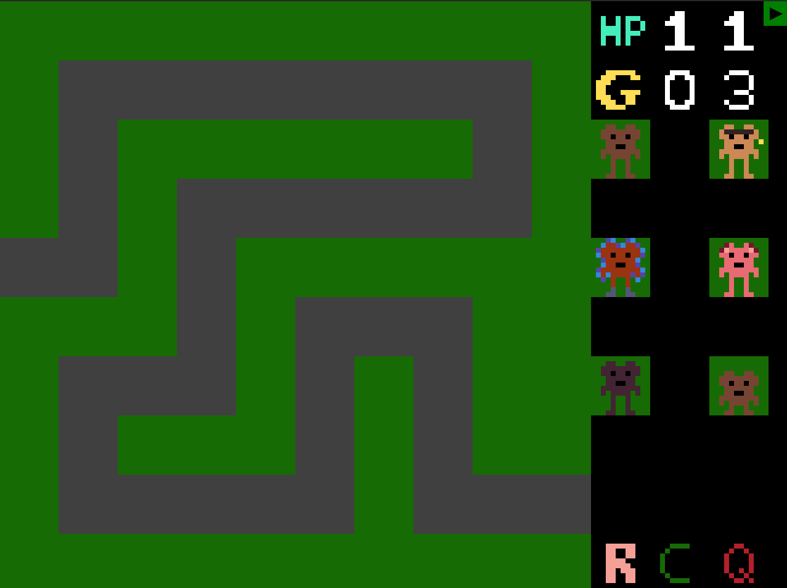
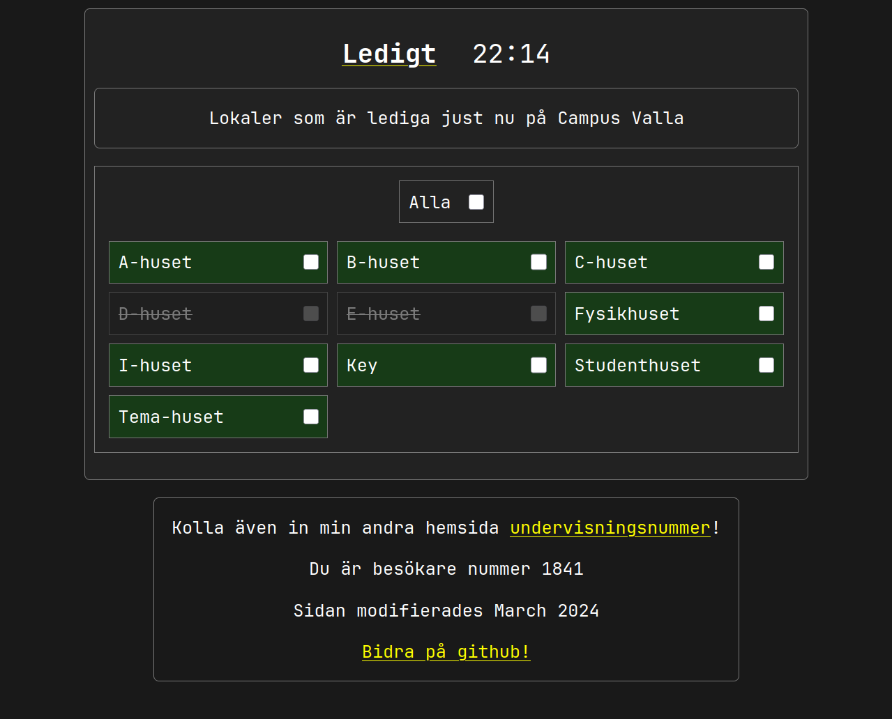
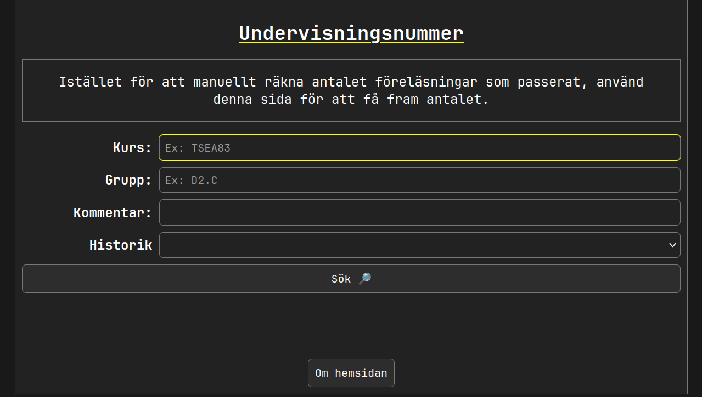

Här är några av mina projekt som jag har gjort under åren. Jag tycker om att hålla all programmering open-source.

## [ironfoil](https://github.com/sermuns/ironfoil) (Mars 2026)

Ett verktyg för att överföra backups av spel från datorn till Nintendo Switch.

## [timeedit-tongs](https://github.com/sermuns/timeedit-tongs) (Februari 2026)

En webbapp skriven i [Dioxus](https://github.com/DioxusLabs/dioxus/) för att hantera Linköping universitets kalendersystem TimeEdit lite enklare.

## [skrytsam](https://github.com/sermuns/skrytsam) (Januari 2026)

`skrytsam` använder GitHub:s API för att hämta statistik om din profil och genererar en snygg grafisk sammanfattning av den.

## [ocarina-tui](https://github.com/sermuns/ocarina-tui) (Januari 2026)

En rolig terminalbaserad Ocarina, från spelet The Legend of Zelda: Ocarina of Time m.m.

## [fontain](https://github.com/sermuns/fontain) (December 2025)

`fontain` är ett kommandoradsverktyg för att ladda ned typsnitt från Google Fonts med mera.

## [MEREAD](https://github.com/sermuns/meread) (Juni 2025)

Enkelt kommandoradsverktyg för att förhandsgranska hur GitHub kommer att rendera din README.md (eller andra Markdown-filer). Skriven i Rust.

## [schemgo](https://github.com/sermuns/schemgo) (Jan 2025)

Experimenterade med att skapa ett alternativ till [SchemDraw](https://schemdraw.readthedocs.io/en/stable/) och [CircuiTikZ](https://www.overleaf.com/learn/latex/CircuiTikz_package), helt skriven i Go.

## [Lysators nya hemsida](https://git.lysator.liu.se/www/hemsida) (Dec 2024)

Utvecklade Lysators nya hemsida. Hemsidan genereras från Markdown genom HTML-templates till statiskt innehåll med SSG:n [`zola`](https://www.getzola.org/documentation/getting-started/overview/) (precis som denna hemsida).

## [monkey computer](https://github.com/sermuns/monkey-computer) (Feb 2024 - Maj 2024)

I grupp, designade och implementerade en processor i VHDL som en del av kursen [Datorkonstruktion](https://studieinfo.liu.se/kurs/tsea83/vt-2018#syllabus).

Till processorn utvecklade jag ett
assembly-liknande språk med tillhörande kompilator skriven i Python, och
VS Code-tillägg för syntax highlighting.

## [Ledigt](http://ledigt.samake.se) (Feb 2024)

Efter att ha skapat och finslipat _Undervisningsnummer_ blev jag sugen på ännu ett projekt som förbättrar studentlivet.

Eftersom jag hade blivit lite mer bekväm med web-scraping så ville jag skapa en hemsida som visar vilka lokaler som är lediga _just nu_ på Linköpings universitet, och WebSockets

## [Undervisningsnummer](http://un.samake.se) (Sept 2023)

En hemsida för att se antal passerade föreläsningar, lektioner m.m. som har passerat i en kurs på Linköpings universitet.

Jag lärde mig väldigt mycket kring HTML, CSS och JavaScript när jag gjorde denna hemsida. Det var speciellt roligt att försöka pussla ihop hur `TimeEdit` fungerar och hur jag skulle kunna använda det för att räkna ut antal föreläsningar som har passerat.
