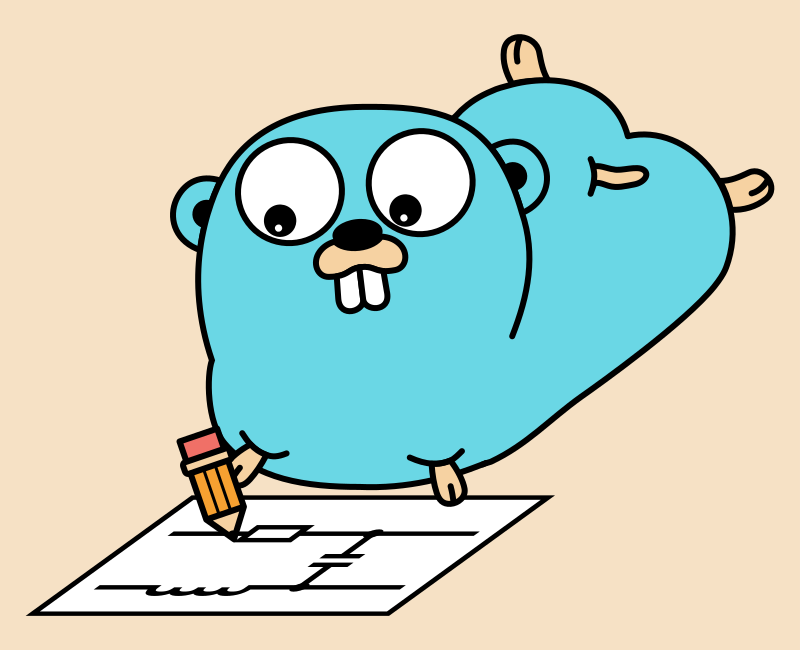
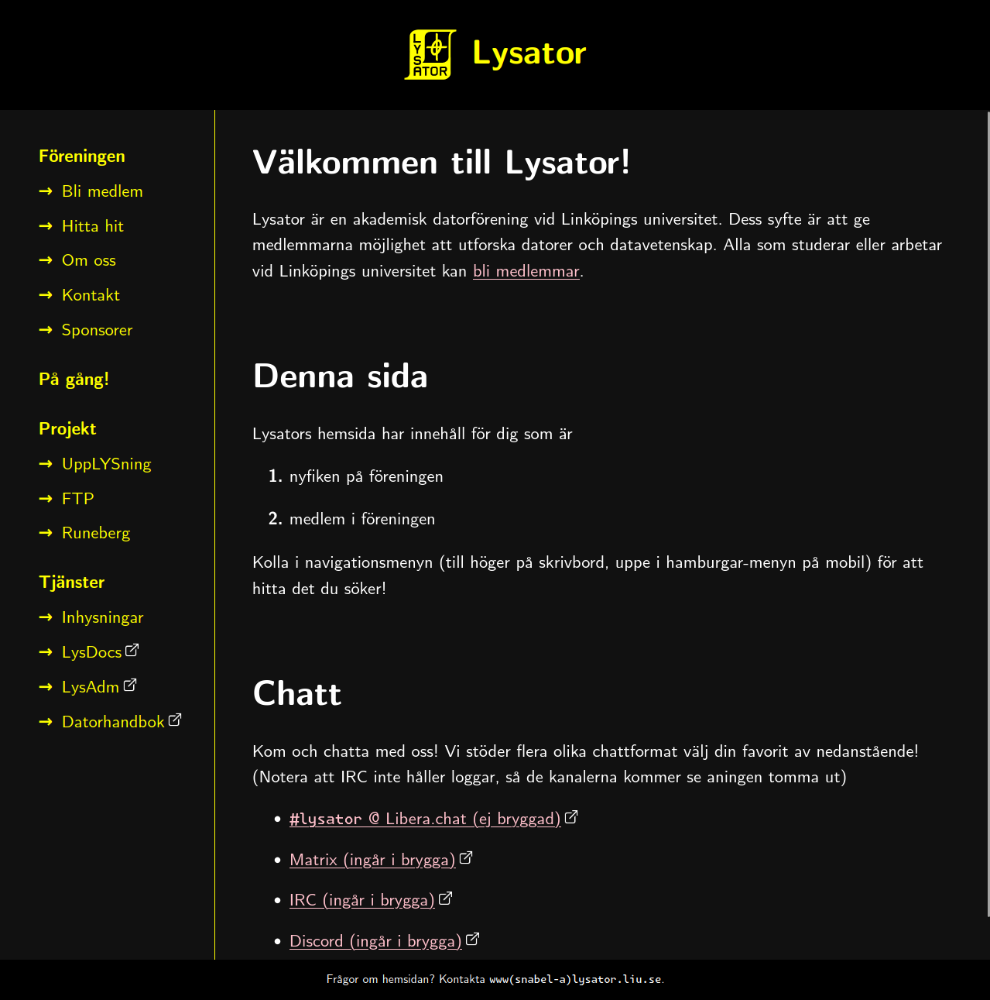
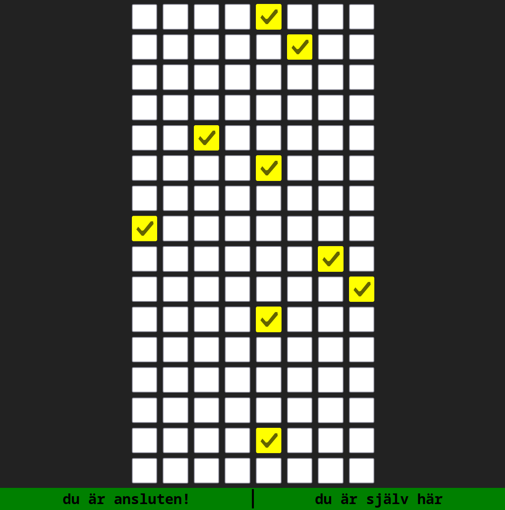
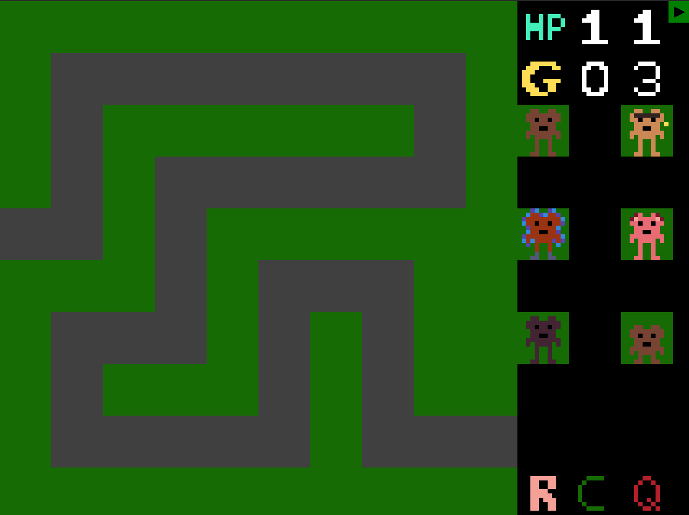
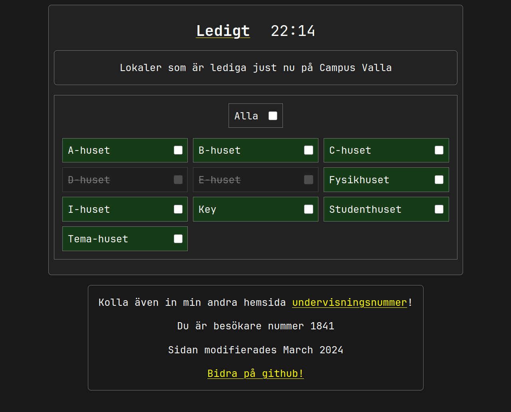
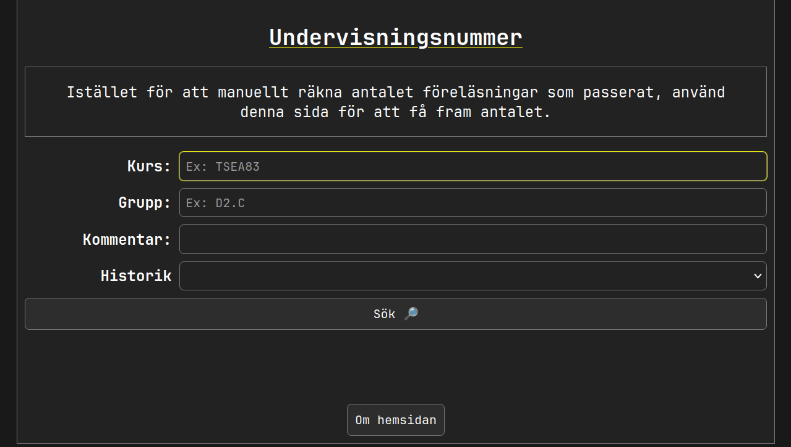

Här är några av mina projekt som jag har gjort under åren. Jag tycker om att hålla all programmering open-source.

## [picodocs](https://github.com/sermuns/picodocs) (Juli 2025)

Skapar just nu ett alternativ till MkDocs med Material for MkDocs, i Rust🦀.

## [MEREAD](https://github.com/sermuns/meread) (Juni 2025)

Enkelt kommandoradsverktyg för att förhandsgranska hur GitHub kommer att rendera din README.md (eller andra Markdown-filer). Skrivet i Rust🦀.

## [schemgo](https://github.com/sermuns/schemgo) (Jan 2025)

Experimenterade med att skapa ett alternativ till [SchemDraw](https://schemdraw.readthedocs.io/en/stable/) och [CircuiTikZ](https://www.overleaf.com/learn/latex/CircuiTikz_package), helt skriven i Go

## [Lysators nya hemsida](https://git.lysator.liu.se/www/hemsida) (Dec 2024)

Utvecklar just nu Lysators nya hemsida. Hemsidan genereras från MarkDown-innehåll genom HTML-templates till statiskt innehåll med SSG:n [`zola`](https://www.getzola.org/documentation/getting-started/overview/) (precis som denna hemsida).

## [128 checkboxes](https://lysator.liu.se/~sermuns/checkboxes) (Dec 2024)

Rolig minimal kopia av [One Million Checkboxes](https://onemillioncheckboxes.com/). Lärde mig använda Go på backend, och WebSockets.

## [monkey computer](https://github.com/sermuns/monkey-computer) (Feb 2024 - Maj 2024)

I grupp, designade och implementerade en processor i VHDL som en del av kursen [Datorkonstruktion](https://studieinfo.liu.se/kurs/tsea83/vt-2018#syllabus).

Till processorn utvecklade jag ett
assembly-liknande språk med tillhörande kompilator skriven i Python, och
VS Code-tillägg för syntax highlighting.

## [Ledigt](http://ledigt.samake.se) (Feb 2024 - Mars 2024)

Efter att ha skapat och finslipat _Undervisningsnummer_ blev jag sugen på ännu ett projekt som förbättrar studentlivet.

Eftersom jag hade blivit lite mer bekväm med web-scraping så ville jag skapa en hemsida som visar vilka lokaler som är lediga _just nu_ på Linköpings universitet, och WebSockets

## [Undervisningsnummer](http://un.samake.se) (Sept 2023 - Okt 2023)

En hemsida för att se antal passerade föreläsningar, lektioner m.m. som har passerat i en kurs på Linköpings universitet.

Jag lärde mig väldigt mycket kring HTML, CSS och JavaScript när jag gjorde denna hemsida. Det var speciellt roligt att försöka pussla ihop hur `TimeEdit` fungerar och hur jag skulle kunna använda det för att räkna ut antal föreläsningar som har passerat.
